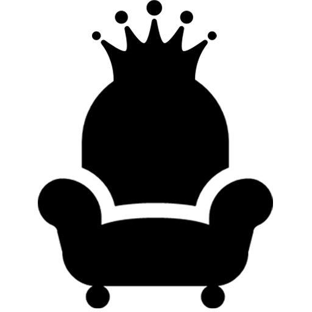

## DIU - Practica3, entregables

### Análisis de MuseMap

  Comienza explicando que función busca cumplir esta aplicación y cual es la idea
  detrás de ella. Se nos dice quienes forman parte del equipo y sus plazos y nos
  explican las peticiones del cliente, en que ámbitos se les presentaba
  una oportunidad para trabajar y que necesidad podrían tener sus usuarios a partir
  de un brainstorming. Finalmente aplican trabajo de campos, desplazándose a un
  parque y observando la interacción de los usuarios con el arte.

### Estudio de aplicaciones similares

  A continuación deciden analizar aplicaciones similares y observar características
  tienen en común y que elementos faltan para saber como podría MuseMap destacar
  entre ellas.

### Entrevistas con usuarios

  Antes de las propias entrevistas, aprovecharon el brainstorming realizado con
  anterioridad para forjar un mapa de empatía que les ayudase a formular las preguntas
  correctas durante las entrevistas.

  Después de estas pudieron formar un mapa de afinidad y descubrieron diferencias
  entre sus ideas iniciales y los resultados del mapa.

### Creación de personas

  En el siguiente paso se crean dos personas ficticias con dos personalidades muy
  diferenciadas, cada una intentando representar los dos principales tipos de
  publico objetivo: aquellos que se topan con el arte callejero de forma intencionada y
  aquellos que lo hacen de forma inintencionada. A partir de una de estas personas
  pueden identificar sus objetivos y aquello que les molesta y crear un User Journey
  y un mapa de experiencia en base a una de las personas para ver como se siente y
  que hace ante una situación concreta.

### Escenarios

  A partir de aquí comienzan a plantearse una serie de escenarios para ver como
  una app podría solucionar algunos de los problemas con los que se encuentran los
  hipotéticos usuarios. A partir de estos escenarios llegan a la conclusión de cual es
  el objetivo final de su app y pueden comenzar con el proceso de diseño.

### Diseño

  Para comenzar a plantear el diseño el equipo crea un diagrama de flujo que
  ejemplificaría el proceso que seguiría un usuario a la hora de usar la app.
  Esto sirve al equipo de desarrollo para prever el curso de acciones de los Usuarios
  y poder diseñar la app con esto en mente. Una vez hecho comienza el diseño propiamente
  dicho creando los primeros bocetos de wireframes y posteriormente haciendo una matriz 2x2 para representar
  que elementos son más o menos importantes y cuales son más o menos difíciles de
  implementar. Esto facilita la elección de que elementos implementar primero, ya que
  aquellos muy altos en la escala de importancia y muy bajos en la de coste deberían ser
  el objetivo principal. Esto nos lleva a los primeros wireframes propiamente dichos. Después
  comienza la etapa de testing que lleva a los wireframes por varios cambios, tanto
  estructurales como en su representación.

### Conclusión

  La app ha seguido un proceso muy interesante, siento que lo más destacable ha sido:

  -Affinity map: Representando todas las ideas y feedback recogido de las
    entrevistas, los desarrolladores pudieron darse cuenta de que existían diferencias
    entre sus planes iniciales y lo que querían los usuarios, lo que los llevo a le
    creación de las personas y los escenarios. Esto es clave pues es no sirve de nada
    hacer una app que nos parezca maravillosa a los desarrolladores pero que no le
    guste a sus publico objetivo, es importante poner ambas perspectivas en la mesa y ver
    como los deseos de los usuarios pueden combinarse con nuestras ideas.

  -Feature Priorisation: Es normal que al comenzar el diseño, todas nuestras ideas
    nos parezcan importantes, pero es necesario priorizar algunas sobre otras y
    pude ser difícil distinguir cuales. Este equipo desarrollo decidió usar una matriz
    de 2x2 para poder ver fácilmente la relación importancia/facilidad de implementación de
    sus ideas. Esto permite ver de un simple vistazo que debe ser priorizado además
    de poder ver todas las ideas representadas en una escala al mismo tiempo.

##Logotipo

Centrándonos ya en nuestro proyecto, el logotipo creado es el siguiente:

Obviamente el tamaño usado variara dependiendo de las necesidades, también es posible crear una versión circular si fuese necesario. La idea era combinar el sofá que representa
la idea del couchsurfing y lo personal y hogareña que es la actividad con una corona
que represente la comodidad que ofrece la página. El diseño ha sido realizado con photoshop CS6. Adicionalmente se ha creado un banner que puede servir para redes sociales. Su tamaño también puede ser variado:

##Guidelines

Buscando en la red, un estilo recomendado para la creación de páginas web profesionales
era merryweather, que además cargaba el ambiente algo royal pero familiar que busca
transmitir la página.

Por el mismo motivo uno de los colores usados es el dorado, el tono concreto era recomendado
en otra web sobre creación de páginas, el gris ha sido elegido por ser un color complementario al
dorado pero más plano. Por último el blanco y negro son los colores básicos que usará la página.

