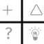

# DIU20
Prácticas Diseño Interfaces de Usuario 2019-20 (Economía Colaborativa)

Grupo: DIU2_cumbia.  Curso: 2019/20

Proyecto: King Couch

Descripción:

Logotipo:

Miembros
 * :bust_in_silhouette:   Sergio Campos Megias     :octocat:     

-----

En esta práctica estudiaremos un caso de plataforma de economía colaborativa y realizaremos una propuesta para su diseño Web/movil. Utilizaremos herramientas y entregables descritos en el siguiente CheckList (https://github.com/mgea/UX-DIU-Checklist)

Qué es economia colaborativa: Martínez-Polo, J. (2019). **El fenómeno del consumo colaborativo: del intercambio de bienes y servicios a la economía de las plataformas**, *Sphera Publica, 1*(19), 24-46. http://sphera.ucam.edu/index.php/sphera-01/article/view/363/14141434

# Proceso de Diseño

##Introducción

¿Te gusta la idea de conocer gente nueva, visitar lugares de ensueño y expandir tus
horizontes? Puede parecer algo de ensueño, pero no solo es posible sino que
completamente gratuito y, gracias a King Couch, más fácil que nunca. Nuestra
página web te permitirá ponerte en contacto con gente que ofrece sus sofás a
cualquiera abierto a la experiencia, grupos donde usuarios más experimentados
te ayudaran a comenzar tu viaje y grandes eventos para poder disfrutar. Todo
con la máxima comodidad y ayuda posible, acogiéndote en todo lo posible y
haciéndote sentir como un rey haya a donde vayas.

## Paso 1. UX Desk Research & Analisis

 1.a Competitive Analysis
-----

Viendo páginas de la competencia como **couchsurfing.com**, nos dimos cuenta de
que estas páginas pueden resultar amenazadoras a primera vista. Características como
la necesidad de registrarse antes de entrar, falta de información o elementos
confusos en los menús pueden hacer que los usuarios que quieren entrar a echar
un vistazo se vayan antes de poder ver lo que ofrece tu página. Nuestro objetivo es
que los usuarios se sientan recibidos desde el primer momento.

 1.b Persona
-----

Para ver la reacción de dos potenciales usuarios crearemos a dos personas
muy diferencidas, uno no es muy diestro con el uso de tecnologías e idiomas mientras
que la otra las domina más y puede pasar por las barreras iniciales que presentan
las páginas de este estilo.

 1.c User Journey Map
----

A partir de estas personas crearemos experiencias que nos muestren como reaccionarían
ante la página estudiada. El primero se ve sobrellevado por las barreras de entrada
de la página y se siente molesto al tener que pedir ayuda para usarla. La segunda
tiene problemas más humanos que serían normales en páginas de este estilo.

 1.d Usability Review
----

Concluiremos esta parte con un análisis de usabilidad para ver que elementos de
la página analizada funcionan y cuales se podrían mejorar.

Enlace al documento: Se encuentran en la carpeta de P1
Valoración final (numérica): 76
Comentario sobre la valoración:  Como vemos, la página presenta ideas muy interesantes
y funcionales, pero sus dura barrera de entrada, falta de información y ausencia de
elementos de comodidad hace que estas ideas no lleguen a la mayoría de usuarios. Incitar a
los nuevos usuarios a usar una página es clave para atraer nuevos usuarios de formar continua.

## Paso 2. UX Design  

 2.a Feedback Capture Grid

A partir de las ideas obtenidas en la etapa anterior, podemos comenzar a forjar
nuestra página, para ello realizaremos un feedback Capture Grid para ver
que funciona, que no y en que debemos centrar nuestra atención.

Más [aquí](https://github.com/sergiostars27/Practicas_DIU/tree/master/P2)

 2.b Tasks & Sitemap
-----
Ahora podemos ver un sitemap que nos ayudará a ver a quien esta dirigido cada
funcionalidad de la página y con que frecuencia será usado o la importancia
que tendrá para la página.

|Objetivos/Usuarios|Usuarios habituales|Usuarios ocasionales o nuevos|administradores|
|-|-|-|-|
|Registrarse en la página (importante)|H|H||
|Buscar información o ayuda (importante)|L|H||
|Unirse a un grupo|M|H||
|Crear un grupo|H|L||
|Buscar un sofá (importante)|H|H||
|Ofrecer su sofá (importante)|H|L||
|Consultar dudas o problemas|L|H|H|
|Realizar búsquedas personalizadas|H|M||
|Expandir su perfil con info no obligatoria|H|L||
|Moderar o banear usuarios|||H|
|Añadir amigos|H|M||
|Organizar eventos|M|L|H|
|Unirse a eventos|H|M||
|Valorar usuario|M|L||

 2.c Labelling

Continuaremos viendo los iconos y pestañas de nuestra página, y que
funcionalidad tendrán.

|Termino|Significado|
|-|-|
|Registrarse|Permite registrarse|
|Iniciar sesión|Una vez registrados permite iniciar nuestra sesión|
|Información|Nos lleva a toda la información referente a la página|
|Foro de dudas|Nos lleva al foro donde podemos preguntar cualquier duda que tengamos sobre la página|
|Perfil|Accede a nuestro perfil|
|Editar perfil|Nos permite editar la información de nuestro perfil|
|Amigos|Nos permite enviar solicitudes de amistad y acceder a nuestros amigos|
|Mi casa|Accedemos a la información sobre la casa de ese perfil|
|Fotos|Accedemos a las fotos que tenga el usuario del perfil|
|Mensajes|Accedemos a los mensajes recibidos|
|Planes|Nos muestra los grupos, eventos o sofás a los que nos hemos unido|
|Intereses|Nos muestra los grupos, eventos o sofás que nos interesen pero aún no nos hayamos unido|
|Búsqueda|Nos permite realizar una búsqueda|
|Buscar sofás|Solo nos muestra sofás|
|Buscar eventos|Solo nos muestra eventos|
|Buscar grupos|Solo nos muestra grupos|
|Buscar usuarios|Solo nos muestra usuarios|
|Personalizar búsqueda|Nos permite añadir parámetros para personalizar nuestra búsqueda|
|Crear|Entramos al menú de creación|
|Crear sofá|Nuestro sofá aparecerá al resto de usuarios|
|Crear grupo|Nos permite crear un grupo que aparecerá al resto de usuarios|
|Crear eventos|Nos permite crear un evento que aparecerá al resto de usuarios, solo aparecerá si somos usuarios bien valorados|
|Valorar positivamente|Nos permite valorar a un usuario de forma positiva y dejar un comentario al respecto|
|Valorar negativamente|Nos permite valorar a un usuario de forma negativa y dejar un comentario al respecto|

 2.d Wireframes
-----

Finalmente crearemos una wireframes para ver en papel el diseño de nuestra página web
y poder plantear cambios en caso de que sea necesario.

## Paso 3. Mi equipo UX-Case Study

 3.a ¿Como se cuenta un UX-Case Study?
----

La conclusión es que usan una forma muy expresiva de contarlo, de forma que
el lector puede saber que problemas se encontraron en todo momento y
como los solucionaron. Los elementos más interesantes han ido el Affinity Map y
el Feature Priorisation ayudando a descubrir que quiere el usuario de verdad y que
deben priorizar los diseñadores respectivamente.
Más [aquí](P3/README.md)

  3.b Logotipo
----
Para el logo hemos usado photoshop CS6, la idea era combinar el sofá que representa
la idea del couchsurfing y lo personal y hogareña que es la actividad con una corona
que represente la comodidad que ofrece la página.

 3.c Guidelines
----
Tanto el estilo de letra como los colores usados eran recomendados en webs que hablaban
sobre la creación de sitios profesionales. Lo que ha decantado su decisión es su tomo royal que
pega con la temática de la página (King Couch).

  3.d Video
----
>>> Documente y resuma el diseño de su producto en forma de video de 90 segundos aprox

## Paso 4. UX Check (Usability Testing)

 4.a A/B Testing
----
>>> Comprobacion de asignaciones para A/B Testing. Asignaciones https://github.com/mgea/DIU19/blob/master/ABtesting.md

>>>> Práctica A:

 4.b User Testing
----

>>> Usuarios para evaluar prácticas

| Usuarios | Sexo/Edad     | Ocupación   |  Exp.TIC    | Personalidad | Plataforma | TestA/B
| ------------- | -------- | ----------- | ----------- | -----------  | ---------- | ----
| User1's name  | H / 18   | Estudiante  | Media       | Introvertido | Web.       | A
| User2's name  | H / 18   | Estudiante  | Media       | Timido       | Web        | A
| User3's name  | M / 35   | Abogado     | Baja        | Emocional    | móvil      | B
| User4's name  | H / 18   | Estudiante  | Media       | Racional     | Web        | B

. 4.c Cuestionario SUS
----

>>> Usaremos el **Cuestionario SUS** para valorar la satisfacción de cada usuario con el diseño (A/B) realizado. Para ello usamos la [hoja de cálculo](https://github.com/mgea/DIU19/blob/master/Cuestionario%20SUS%20DIU.xlsx) para calcular resultados sigiendo las pautas para usar la escala SUS e interpretar los resultados
http://usabilitygeek.com/how-to-use-the-system-usability-scale-sus-to-evaluate-the-usability-of-your-website/)
Para más información, consultar aquí sobre la [metodología SUS](https://cui.unige.ch/isi/icle-wiki/_media/ipm:test-suschapt.pdf)

>>> Adjuntar captura de imagen con los resultados + Valoración personal

 4.c Usability Report
----

>> Añadir report de usabilidad para práctica B

## Paso 5. Evaluación de Accesibilidad  

  5.a Accesibility evaluation Report
----

>>> Indica qué pretendes evaluar (de accesibilidad) y qué resultados has obtenido + Valoración personal

>>> Evaluación de la Accesibilidad (con simuladores o verificación de WACG)

## Conclusión / Valoración de las prácticas

>>> (90-150 caracteres) Opinión del proceso de desarrollo de diseño siguiendo metodología UX y valoración (positiva /negativa) de los resultados obtenidos  
